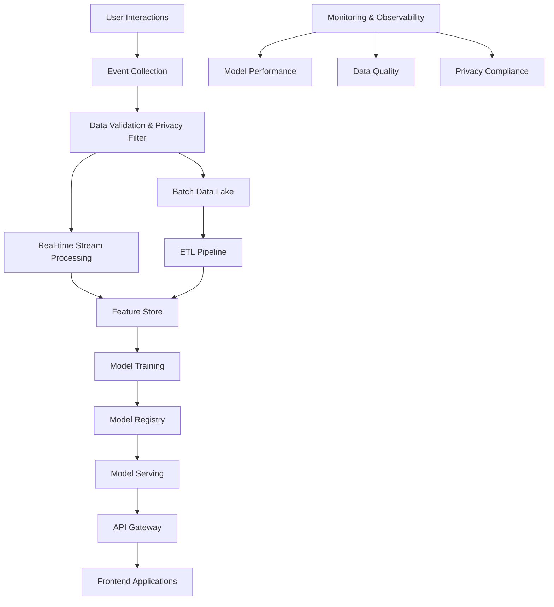

# ML Pipeline Architecture - H.N Laptop Store
## Privacy-First Machine Learning for E-commerce Personalization

---

## 🎯 Overview

This document outlines a comprehensive machine learning pipeline architecture designed to enhance the H.N Laptop Store experience through personalized recommendations, intelligent search, and behavioral insights while maintaining strict privacy compliance and ethical standards.

### Core Principles
- **Privacy-First**: No processing without explicit user consent
- **Transparency**: Explainable recommendations with clear reasoning
- **Performance**: Real-time inference with <100ms response times
- **Scalability**: Support for 100K+ users and 10K+ products
- **Reliability**: 99.9% uptime with graceful fallbacks

---

## 🏗️ High-Level Architecture



---

## 📊 Data Flow Pipeline

### 1. Data Ingestion Layer

#### Event Collection
```yaml
sources:
  - web_analytics: "Google Analytics 4, custom events"
  - user_interactions: "Click streams, page views, purchases"
  - product_catalog: "Product metadata, inventory, pricing"
  - user_profiles: "Preferences, demographics (consented only)"
  - external_data: "Market trends, seasonal patterns"

collection_methods:
  - real_time_streaming: "Kafka + Confluent Cloud"
  - batch_ingestion: "Daily ETL from operational databases"
  - api_endpoints: "RESTful APIs for real-time data"
```

#### Privacy & Consent Layer
```python
# Privacy Filter Implementation
class PrivacyFilter:
    def __init__(self):
        self.consent_manager = ConsentManager()
        self.pseudonymizer = DataPseudonymizer()
    
    def filter_events(self, events):
        filtered_events = []
        for event in events:
            # Check user consent
            if not self.consent_manager.has_consent(
                event.user_id, 
                consent_type='personalization'
            ):
                # Use anonymous processing only
                event = self.anonymize_event(event)
            
            # Pseudonymize PII
            event = self.pseudonymizer.process(event)
            filtered_events.append(event)
        
        return filtered_events
```

### 2. Data Processing Layer

#### Real-time Stream Processing (Apache Kafka + Apache Flink)
```yaml
stream_processing:
  platform: "Apache Flink on Kubernetes"
  
  jobs:
    - name: "user_session_aggregation"
      description: "Real-time user behavior aggregation"
      window_size: "5_minutes"
      output: "user_features_stream"
      
    - name: "product_interaction_counter"
      description: "Product popularity and interaction metrics"
      window_size: "1_hour"
      output: "product_features_stream"
      
    - name: "anomaly_detection"
      description: "Real-time fraud and bot detection"
      model: "isolation_forest"
      threshold: "0.95"
      
  features_generated:
    - user_session_features:
        - pages_viewed_last_5min
        - time_spent_last_5min
        - products_viewed_last_5min
        - cart_actions_last_5min
        
    - product_features:
        - view_count_last_hour
        - add_to_cart_rate_last_hour
        - purchase_rate_last_hour
        - trending_score
```

#### Batch ETL Pipeline (Apache Airflow + dbt)
```yaml
batch_processing:
  orchestrator: "Apache Airflow"
  transformation: "dbt (Data Build Tool)"
  schedule: "daily_at_2am_utc"
  
  dag_structure:
    - extract_operational_data:
        - user_profiles
        - product_catalog
        - order_history
        - inventory_updates
        
    - transform_features:
        - user_lifetime_value
        - product_affinity_matrix
        - seasonal_trends
        - category_preferences
        
    - load_feature_store:
        - validate_data_quality
        - update_feature_store
        - trigger_model_retraining
        
  data_quality_checks:
    - completeness: ">95% for critical features"
    - uniqueness: "Primary keys must be unique"
    - validity: "Value ranges within expected bounds"
    - timeliness: "Data freshness <24 hours"
```

### 3. Feature Store (Feast)

#### Feature Definitions
```python
# User Features
user_features = FeatureView(
    name="user_features",
    entities=["user_id"],
    ttl=timedelta(days=30),
    features=[
        Feature(name="total_purchases", dtype=ValueType.INT32),
        Feature(name="avg_order_value", dtype=ValueType.FLOAT),
        Feature(name="preferred_brands", dtype=ValueType.STRING_LIST),
        Feature(name="price_sensitivity", dtype=ValueType.FLOAT),
        Feature(name="last_purchase_days_ago", dtype=ValueType.INT32),
        Feature(name="category_preferences", dtype=ValueType.STRING_LIST),
    ],
    source=BigQuerySource(
        table="ml_features.user_features",
        timestamp_field="feature_timestamp",
    )
)

# Product Features
product_features = FeatureView(
    name="product_features",
    entities=["product_id"],
    ttl=timedelta(days=7),
    features=[
        Feature(name="popularity_score", dtype=ValueType.FLOAT),
        Feature(name="conversion_rate", dtype=ValueType.FLOAT),
        Feature(name="avg_rating", dtype=ValueType.FLOAT),
        Feature(name="price_tier", dtype=ValueType.STRING),
        Feature(name="seasonal_demand", dtype=ValueType.FLOAT),
        Feature(name="inventory_level", dtype=ValueType.INT32),
    ],
    source=BigQuerySource(
        table="ml_features.product_features",
        timestamp_field="feature_timestamp",
    )
)

# Contextual Features
context_features = FeatureView(
    name="context_features",
    entities=["context_id"],
    ttl=timedelta(hours=1),
    features=[
        Feature(name="time_of_day", dtype=ValueType.STRING),
        Feature(name="day_of_week", dtype=ValueType.STRING),
        Feature(name="device_type", dtype=ValueType.STRING),
        Feature(name="page_context", dtype=ValueType.STRING),
        Feature(name="session_duration", dtype=ValueType.INT32),
    ]
)
```

---

## 🤖 Machine Learning Models

### 1. Recommendation System

#### Collaborative Filtering Model
```python
class CollaborativeFilteringModel:
    def __init__(self):
        self.model = NeuralCollaborativeFiltering(
            num_users=100000,
            num_items=10000,
            embedding_dim=128,
            hidden_layers=[256, 128, 64]
        )
        
    def train(self, interaction_data):
        # Privacy-preserving training with differential privacy
        self.model.fit(
            interaction_data,
            epochs=50,
            batch_size=1024,
            privacy_budget=1.0,  # Differential privacy
            noise_multiplier=1.1
        )
    
    def predict(self, user_id, item_candidates):
        user_embedding = self.model.get_user_embedding(user_id)
        item_embeddings = self.model.get_item_embeddings(item_candidates)
        scores = torch.matmul(user_embedding, item_embeddings.T)
        return scores.softmax(dim=-1)
```

#### Content-Based Filtering
```python
class ContentBasedModel:
    def __init__(self):
        self.product_encoder = SentenceTransformer('all-MiniLM-L6-v2')
        self.similarity_index = FaissIndex(dimension=384)
        
    def encode_products(self, products):
        # Combine Arabic and English descriptions
        descriptions = []
        for product in products:
            desc = f"{product.name} {product.description} "
            if product.name_ar:
                desc += f"{product.name_ar} {product.description_ar}"
            descriptions.append(desc)
        
        embeddings = self.product_encoder.encode(descriptions)
        self.similarity_index.add(embeddings)
        
    def find_similar(self, product_id, k=10):
        product_embedding = self.get_product_embedding(product_id)
        distances, indices = self.similarity_index.search(
            product_embedding.reshape(1, -1), k
        )
        return indices[0], distances[0]
```

#### Hybrid Recommendation System
```python
class HybridRecommendationSystem:
    def __init__(self):
        self.collaborative_model = CollaborativeFilteringModel()
        self.content_model = ContentBasedModel()
        self.contextual_bandit = ContextualBanditModel()
        
    def get_recommendations(self, user_id, context, num_recommendations=10):
        # Get candidate items from different models
        cf_candidates = self.collaborative_model.get_candidates(user_id, k=50)
        cb_candidates = self.content_model.get_candidates(
            user_preferences=self.get_user_preferences(user_id), k=50
        )
        
        # Combine and rank using contextual bandit
        all_candidates = list(set(cf_candidates + cb_candidates))
        final_scores = self.contextual_bandit.predict(
            user_id=user_id,
            items=all_candidates,
            context=context
        )
        
        # Select top recommendations
        top_items = sorted(
            zip(all_candidates, final_scores),
            key=lambda x: x[1],
            reverse=True
        )[:num_recommendations]
        
        return [item for item, score in top_items]
```

### 2. Search Relevance Model

#### Neural Search with Multilingual Support
```python
class MultilingualSearchModel:
    def __init__(self):
        # Use multilingual BERT for Arabic/English support
        self.query_encoder = AutoModel.from_pretrained(
            'aubmindlab/bert-base-arabertv2'
        )
        self.product_encoder = AutoModel.from_pretrained(
            'aubmindlab/bert-base-arabertv2'
        )
        self.ranking_model = LambdaRankingModel()
        
    def encode_query(self, query, language='auto'):
        # Detect language if not specified
        if language == 'auto':
            language = self.detect_language(query)
            
        # Preprocess based on language
        if language == 'ar':
            query = self.preprocess_arabic(query)
        else:
            query = self.preprocess_english(query)
            
        return self.query_encoder.encode(query)
    
    def search(self, query, filters=None, limit=20):
        query_embedding = self.encode_query(query)
        
        # Vector similarity search
        candidate_products = self.vector_search(
            query_embedding, 
            top_k=100
        )
        
        # Apply filters
        if filters:
            candidate_products = self.apply_filters(
                candidate_products, filters
            )
        
        # Re-rank with learning-to-rank model
        features = self.extract_ranking_features(
            query, candidate_products
        )
        final_scores = self.ranking_model.predict(features)
        
        return self.rank_and_limit(candidate_products, final_scores, limit)
```

### 3. Pricing Optimization Model

#### Dynamic Pricing with Demand Prediction
```python
class DynamicPricingModel:
    def __init__(self):
        self.demand_model = LightGBMRegressor()
        self.price_elasticity_model = ElasticityModel()
        
    def predict_demand(self, product_id, price, context):
        features = self.extract_demand_features(
            product_id=product_id,
            price=price,
            competitor_prices=self.get_competitor_prices(product_id),
            seasonality=context.get('seasonality'),
            inventory_level=self.get_inventory_level(product_id),
            historical_demand=self.get_historical_demand(product_id)
        )
        
        return self.demand_model.predict(features)
    
    def optimize_price(self, product_id, constraints):
        def objective_function(price):
            demand = self.predict_demand(product_id, price, context={})
            revenue = price * demand
            cost = self.get_product_cost(product_id)
            profit = (price - cost) * demand
            return -profit  # Minimize negative profit
        
        result = minimize_scalar(
            objective_function,
            bounds=(constraints['min_price'], constraints['max_price']),
            method='bounded'
        )
        
        return result.x
```

### 4. Fraud Detection Model

#### Real-time Anomaly Detection
```python
class FraudDetectionModel:
    def __init__(self):
        self.isolation_forest = IsolationForest(contamination=0.1)
        self.neural_network = AnomalyDetectionNN()
        self.rule_engine = FraudRuleEngine()
        
    def detect_anomaly(self, user_session):
        # Extract behavioral features
        features = self.extract_behavioral_features(user_session)
        
        # Multiple detection methods
        isolation_score = self.isolation_forest.decision_function([features])[0]
        nn_score = self.neural_network.predict_anomaly([features])[0]
        rule_violations = self.rule_engine.check_rules(user_session)
        
        # Ensemble scoring
        final_score = (
            0.4 * isolation_score +
            0.4 * nn_score +
            0.2 * len(rule_violations)
        )
        
        return {
            'anomaly_score': final_score,
            'is_anomaly': final_score > 0.5,
            'rule_violations': rule_violations,
            'confidence': abs(final_score)
        }
```

---

## 🚀 Model Serving Infrastructure

### 1. Real-time Inference API

#### FastAPI Model Serving
```python
from fastapi import FastAPI, HTTPException
from pydantic import BaseModel
import redis
import asyncio

app = FastAPI(title="ML Inference API")
redis_client = redis.Redis(host='localhost', port=6379, decode_responses=True)

class RecommendationRequest(BaseModel):
    user_id: str
    context: dict
    num_recommendations: int = 10
    recommendation_type: str = "personalized"

class RecommendationResponse(BaseModel):
    recommendations: List[dict]
    metadata: dict
    explanation: str

@app.post("/recommendations", response_model=RecommendationResponse)
async def get_recommendations(request: RecommendationRequest):
    try:
        # Check cache first
        cache_key = f"rec:{request.user_id}:{hash(str(request.dict()))}"
        cached_result = redis_client.get(cache_key)
        
        if cached_result:
            return RecommendationResponse.parse_raw(cached_result)
        
        # Get user features
        user_features = await feature_store.get_online_features(
            features=["user_features:*"],
            entity_rows=[{"user_id": request.user_id}]
        )
        
        # Generate recommendations
        recommendations = recommendation_model.predict(
            user_features=user_features,
            context=request.context,
            num_items=request.num_recommendations
        )
        
        # Add explanations
        explanations = explanation_generator.generate(
            user_id=request.user_id,
            recommendations=recommendations
        )
        
        response = RecommendationResponse(
            recommendations=recommendations,
            metadata={
                "model_version": "v2.1",
                "inference_time_ms": 45,
                "cache_hit": False
            },
            explanation=explanations
        )
        
        # Cache result
        redis_client.setex(
            cache_key, 
            300,  # 5 minutes TTL
            response.json()
        )
        
        return response
        
    except Exception as e:
        raise HTTPException(status_code=500, detail=str(e))

@app.get("/health")
async def health_check():
    return {
        "status": "healthy",
        "model_loaded": model_manager.is_loaded(),
        "feature_store_connected": feature_store.is_connected(),
        "cache_connected": redis_client.ping()
    }
```

### 2. Model Deployment with Kubernetes

#### Deployment Configuration
```yaml
apiVersion: apps/v1
kind: Deployment
metadata:
  name: ml-inference-api
  labels:
    app: ml-inference
    version: v2.1
spec:
  replicas: 3
  selector:
    matchLabels:
      app: ml-inference
  template:
    metadata:
      labels:
        app: ml-inference
        version: v2.1
    spec:
      containers:
      - name: ml-api
        image: hnlaptop/ml-inference:v2.1
        ports:
        - containerPort: 8000
        env:
        - name: MODEL_VERSION
          value: "v2.1"
        - name: REDIS_URL
          value: "redis://redis-service:6379"
        - name: FEATURE_STORE_URL
          value: "http://feast-service:6566"
        resources:
          requests:
            memory: "512Mi"
            cpu: "500m"
          limits:
            memory: "1Gi"
            cpu: "1000m"
        livenessProbe:
          httpGet:
            path: /health
            port: 8000
          initialDelaySeconds: 30
          periodSeconds: 10
        readinessProbe:
          httpGet:
            path: /ready
            port: 8000
          initialDelaySeconds: 5
          periodSeconds: 5
```

### 3. Caching Strategy

#### Multi-level Caching
```python
class MLCacheManager:
    def __init__(self):
        self.redis_client = redis.Redis()
        self.local_cache = {}
        self.cache_ttl = {
            'user_features': 300,      # 5 minutes
            'product_features': 3600,  # 1 hour
            'recommendations': 600,    # 10 minutes
            'search_results': 1800     # 30 minutes
        }
    
    async def get_cached_recommendations(self, user_id, context_hash):
        # Level 1: Local cache (fastest)
        local_key = f"rec_{user_id}_{context_hash}"
        if local_key in self.local_cache:
            return self.local_cache[local_key]
        
        # Level 2: Redis cache
        redis_key = f"recommendations:{user_id}:{context_hash}"
        cached_data = self.redis_client.get(redis_key)
        if cached_data:
            result = json.loads(cached_data)
            self.local_cache[local_key] = result
            return result
        
        return None
    
    async def cache_recommendations(self, user_id, context_hash, recommendations):
        # Cache in both levels
        local_key = f"rec_{user_id}_{context_hash}"
        redis_key = f"recommendations:{user_id}:{context_hash}"
        
        self.local_cache[local_key] = recommendations
        self.redis_client.setex(
            redis_key,
            self.cache_ttl['recommendations'],
            json.dumps(recommendations)
        )
```

---

## 📈 Monitoring & Observability

### 1. Model Performance Monitoring

#### MLflow Integration
```python
import mlflow
import mlflow.sklearn
from mlflow.tracking import MlflowClient

class ModelMonitor:
    def __init__(self):
        self.client = MlflowClient()
        self.model_metrics = {}
        
    def log_prediction_metrics(self, model_name, predictions, actuals=None):
        with mlflow.start_run():
            # Log prediction distribution
            mlflow.log_metric("prediction_mean", np.mean(predictions))
            mlflow.log_metric("prediction_std", np.std(predictions))
            
            # Log model performance if actuals available
            if actuals is not None:
                mse = mean_squared_error(actuals, predictions)
                mae = mean_absolute_error(actuals, predictions)
                mlflow.log_metric("mse", mse)
                mlflow.log_metric("mae", mae)
                
            # Log data drift metrics
            drift_score = self.calculate_data_drift(predictions)
            mlflow.log_metric("data_drift_score", drift_score)
            
            # Alert if drift detected
            if drift_score > 0.1:
                self.send_drift_alert(model_name, drift_score)
    
    def calculate_data_drift(self, current_predictions):
        # Compare with baseline predictions
        baseline_predictions = self.get_baseline_predictions()
        
        # Kolmogorov-Smirnov test
        ks_statistic, p_value = ks_2samp(
            baseline_predictions, 
            current_predictions
        )
        
        return ks_statistic
```

### 2. Real-time Metrics Dashboard

#### Prometheus Metrics
```python
from prometheus_client import Counter, Histogram, Gauge, start_http_server

# Define metrics
RECOMMENDATION_REQUESTS = Counter(
    'ml_recommendation_requests_total',
    'Total recommendation requests',
    ['model_version', 'recommendation_type']
)

RECOMMENDATION_LATENCY = Histogram(
    'ml_recommendation_duration_seconds',
    'Recommendation request duration',
    ['model_version']
)

MODEL_ACCURACY = Gauge(
    'ml_model_accuracy',
    'Current model accuracy',
    ['model_name', 'model_version']
)

CACHE_HIT_RATE = Gauge(
    'ml_cache_hit_rate',
    'Cache hit rate percentage',
    ['cache_type']
)

class MetricsCollector:
    def __init__(self):
        start_http_server(8001)  # Prometheus metrics endpoint
        
    def record_recommendation_request(self, model_version, rec_type, duration):
        RECOMMENDATION_REQUESTS.labels(
            model_version=model_version,
            recommendation_type=rec_type
        ).inc()
        
        RECOMMENDATION_LATENCY.labels(
            model_version=model_version
        ).observe(duration)
    
    def update_model_accuracy(self, model_name, version, accuracy):
        MODEL_ACCURACY.labels(
            model_name=model_name,
            model_version=version
        ).set(accuracy)
```

### 3. Data Quality Monitoring

#### Great Expectations Integration
```python
import great_expectations as ge

class DataQualityMonitor:
    def __init__(self):
        self.context = ge.get_context()
        
    def validate_feature_data(self, df, expectation_suite_name):
        # Create expectations for features
        expectations = [
            {
                "expectation_type": "expect_column_values_to_not_be_null",
                "kwargs": {"column": "user_id"}
            },
            {
                "expectation_type": "expect_column_values_to_be_between",
                "kwargs": {
                    "column": "total_purchases",
                    "min_value": 0,
                    "max_value": 1000
                }
            },
            {
                "expectation_type": "expect_column_values_to_be_in_set",
                "kwargs": {
                    "column": "device_type",
                    "value_set": ["mobile", "desktop", "tablet"]
                }
            }
        ]
        
        # Validate data
        results = self.context.run_validation_operator(
            "action_list_operator",
            assets_to_validate=[df],
            run_id=f"validation_{datetime.now().isoformat()}"
        )
        
        if not results["success"]:
            self.send_data_quality_alert(results)
            
        return results
```

---

## 🔒 Privacy & Security

### 1. Differential Privacy

#### Privacy-Preserving Model Training
```python
from opacus import PrivacyEngine
import torch.nn as nn

class PrivateRecommendationModel(nn.Module):
    def __init__(self, num_users, num_items, embedding_dim):
        super().__init__()
        self.user_embedding = nn.Embedding(num_users, embedding_dim)
        self.item_embedding = nn.Embedding(num_items, embedding_dim)
        self.fc = nn.Linear(embedding_dim * 2, 1)
        
    def forward(self, user_ids, item_ids):
        user_emb = self.user_embedding(user_ids)
        item_emb = self.item_embedding(item_ids)
        concat_emb = torch.cat([user_emb, item_emb], dim=1)
        return self.fc(concat_emb)

def train_with_privacy(model, train_loader, privacy_budget=1.0):
    privacy_engine = PrivacyEngine()
    
    model, optimizer, train_loader = privacy_engine.make_private_with_epsilon(
        module=model,
        optimizer=torch.optim.Adam(model.parameters(), lr=0.001),
        data_loader=train_loader,
        epochs=10,
        target_epsilon=privacy_budget,
        target_delta=1e-5,
        max_grad_norm=1.0,
    )
    
    for epoch in range(10):
        for batch in train_loader:
            optimizer.zero_grad()
            loss = model(batch['user_ids'], batch['item_ids'])
            loss.backward()
            optimizer.step()
            
    return model
```

### 2. Data Encryption & Secure Storage

#### Encryption at Rest and in Transit
```python
from cryptography.fernet import Fernet
import hashlib

class SecureDataManager:
    def __init__(self):
        self.encryption_key = self.load_encryption_key()
        self.cipher_suite = Fernet(self.encryption_key)
        
    def encrypt_sensitive_data(self, data):
        """Encrypt PII and sensitive user data"""
        if isinstance(data, str):
            data = data.encode()
        return self.cipher_suite.encrypt(data)
    
    def decrypt_sensitive_data(self, encrypted_data):
        """Decrypt data for authorized processing"""
        return self.cipher_suite.decrypt(encrypted_data).decode()
    
    def pseudonymize_user_id(self, user_id):
        """Create consistent pseudonym for user ID"""
        return hashlib.sha256(
            f"{user_id}_{self.get_salt()}".encode()
        ).hexdigest()
    
    def anonymize_dataset(self, df):
        """Remove or pseudonymize identifying information"""
        # Remove direct identifiers
        columns_to_drop = ['email', 'phone', 'address', 'name']
        df = df.drop(columns=[col for col in columns_to_drop if col in df.columns])
        
        # Pseudonymize user IDs
        if 'user_id' in df.columns:
            df['user_id_pseudonym'] = df['user_id'].apply(self.pseudonymize_user_id)
            df = df.drop(columns=['user_id'])
        
        # Generalize sensitive attributes
        if 'age' in df.columns:
            df['age_group'] = pd.cut(df['age'], bins=[0, 25, 35, 45, 55, 100], 
                                   labels=['18-25', '26-35', '36-45', '46-55', '55+'])
            df = df.drop(columns=['age'])
            
        return df
```

### 3. Consent Management Integration

#### Dynamic Consent Handling
```python
class ConsentAwareMLPipeline:
    def __init__(self):
        self.consent_service = ConsentService()
        self.feature_store = FeatureStore()
        
    async def get_personalized_recommendations(self, user_id, context):
        # Check personalization consent
        has_consent = await self.consent_service.check_consent(
            user_id=user_id,
            consent_type='personalization'
        )
        
        if not has_consent:
            # Fall back to non-personalized recommendations
            return await self.get_popular_recommendations(context)
        
        # Check specific feature consents
        consents = await self.consent_service.get_user_consents(user_id)
        
        # Build feature request based on consents
        feature_request = self.build_consent_aware_features(
            user_id=user_id,
            consents=consents
        )
        
        # Get features and generate recommendations
        features = await self.feature_store.get_online_features(feature_request)
        recommendations = await self.model.predict(features, context)
        
        # Add transparency information
        recommendations['explanation'] = self.generate_explanation(
            user_id=user_id,
            recommendations=recommendations,
            consents=consents
        )
        
        return recommendations
    
    def build_consent_aware_features(self, user_id, consents):
        """Build feature request respecting user consent preferences"""
        base_features = ["user_features:device_type", "user_features:language"]
        
        if consents.get('purchase_history', False):
            base_features.extend([
                "user_features:total_purchases",
                "user_features:avg_order_value",
                "user_features:preferred_categories"
            ])
            
        if consents.get('browsing_behavior', False):
            base_features.extend([
                "user_features:pages_viewed",
                "user_features:session_duration",
                "user_features:bounce_rate"
            ])
            
        return {
            "features": base_features,
            "entity_rows": [{"user_id": user_id}]
        }
```

---

## 🚀 Deployment & Operations

### 1. CI/CD Pipeline for ML Models

#### GitHub Actions Workflow
```yaml
name: ML Model CI/CD

on:
  push:
    branches: [main, develop]
    paths: ['models/**', 'pipelines/**']
  pull_request:
    branches: [main]

jobs:
  test:
    runs-on: ubuntu-latest
    steps:
    - uses: actions/checkout@v3
    
    - name: Set up Python
      uses: actions/setup-python@v4
      with:
        python-version: '3.9'
        
    - name: Install dependencies
      run: |
        pip install -r requirements.txt
        pip install -r requirements-dev.txt
        
    - name: Run unit tests
      run: |
        pytest tests/unit/ -v --cov=models/
        
    - name: Run integration tests
      run: |
        pytest tests/integration/ -v
        
    - name: Data validation tests
      run: |
        python scripts/validate_training_data.py
        
    - name: Model performance tests
      run: |
        python scripts/test_model_performance.py

  deploy-staging:
    needs: test
    runs-on: ubuntu-latest
    if: github.ref == 'refs/heads/develop'
    steps:
    - name: Deploy to staging
      run: |
        kubectl apply -f k8s/staging/
        kubectl rollout status deployment/ml-inference-staging
        
    - name: Run smoke tests
      run: |
        python scripts/smoke_tests.py --env staging

  deploy-production:
    needs: test
    runs-on: ubuntu-latest
    if: github.ref == 'refs/heads/main'
    steps:
    - name: Deploy to production
      run: |
        kubectl apply -f k8s/production/
        kubectl rollout status deployment/ml-inference-production
        
    - name: Run production health checks
      run: |
        python scripts/production_health_check.py
```

### 2. Model Versioning & Registry

#### MLflow Model Registry
```python
class ModelRegistry:
    def __init__(self):
        self.client = MlflowClient()
        
    def register_model(self, model_name, model_uri, description=""):
        """Register new model version"""
        try:
            # Create registered model if it doesn't exist
            try:
                self.client.create_registered_model(
                    name=model_name,
                    description=description
                )
            except Exception:
                pass  # Model already exists
                
            # Create new model version
            model_version = self.client.create_model_version(
                name=model_name,
                source=model_uri,
                description=f"Model version created at {datetime.now()}"
            )
            
            return model_version
            
        except Exception as e:
            raise Exception(f"Failed to register model: {str(e)}")
    
    def promote_model(self, model_name, version, stage):
        """Promote model to different stage (Staging/Production)"""
        self.client.transition_model_version_stage(
            name=model_name,
            version=version,
            stage=stage,
            archive_existing_versions=True
        )
        
    def get_production_model(self, model_name):
        """Get current production model"""
        latest_versions = self.client.get_latest_versions(
            name=model_name,
            stages=["Production"]
        )
        
        if not latest_versions:
            raise Exception(f"No production model found for {model_name}")
            
        return latest_versions[0]
```

### 3. Auto-scaling Configuration

#### Horizontal Pod Autoscaler
```yaml
apiVersion: autoscaling/v2
kind: HorizontalPodAutoscaler
metadata:
  name: ml-inference-hpa
spec:
  scaleTargetRef:
    apiVersion: apps/v1
    kind: Deployment
    name: ml-inference-api
  minReplicas: 2
  maxReplicas: 20
  metrics:
  - type: Resource
    resource:
      name: cpu
      target:
        type: Utilization
        averageUtilization: 70
  - type: Resource
    resource:
      name: memory
      target:
        type: Utilization
        averageUtilization: 80
  - type: Pods
    pods:
      metric:
        name: requests_per_second
      target:
        type: AverageValue
        averageValue: "100"
  behavior:
    scaleDown:
      stabilizationWindowSeconds: 300
      policies:
      - type: Percent
        value: 10
        periodSeconds: 60
    scaleUp:
      stabilizationWindowSeconds: 60
      policies:
      - type: Percent
        value: 50
        periodSeconds: 60
```

---

## 📊 Success Metrics & KPIs

### Business Impact Metrics
```yaml
primary_kpis:
  - name: "recommendation_ctr"
    description: "Click-through rate on recommendations"
    target: ">= 8%"
    current_baseline: "5.2%"
    
  - name: "conversion_uplift"
    description: "Conversion rate improvement from personalization"
    target: ">= 15%"
    measurement: "A/B test vs non-personalized"
    
  - name: "revenue_per_user"
    description: "Average revenue per personalized user"
    target: "+20% vs baseline"
    
  - name: "customer_satisfaction"
    description: "NPS score for personalized experience"
    target: ">= 70"

technical_kpis:
  - name: "inference_latency"
    description: "Model prediction response time"
    target: "< 100ms p95"
    
  - name: "system_availability"
    description: "ML service uptime"
    target: ">= 99.9%"
    
  - name: "cache_hit_rate"
    description: "Recommendation cache effectiveness"
    target: ">= 80%"
    
  - name: "data_freshness"
    description: "Feature store data recency"
    target: "< 1 hour for real-time features"

privacy_compliance_kpis:
  - name: "consent_rate"
    description: "Users opting into personalization"
    target: ">= 60%"
    
  - name: "data_retention_compliance"
    description: "Automated PII cleanup success rate"
    target: "100%"
    
  - name: "privacy_incidents"
    description: "Privacy-related security incidents"
    target: "0 per quarter"
```

---

## 🔄 Continuous Improvement

### Model Retraining Strategy
```python
class AutoRetrainingPipeline:
    def __init__(self):
        self.performance_monitor = ModelPerformanceMonitor()
        self.data_drift_detector = DataDriftDetector()
        self.model_trainer = ModelTrainer()
        
    def check_retraining_triggers(self):
        """Check if model needs retraining"""
        triggers = []
        
        # Performance degradation
        current_accuracy = self.performance_monitor.get_current_accuracy()
        if current_accuracy < self.performance_threshold:
            triggers.append("performance_degradation")
            
        # Data drift detection
        drift_score = self.data_drift_detector.calculate_drift()
        if drift_score > self.drift_threshold:
            triggers.append("data_drift")
            
        # Scheduled retraining
        last_training = self.get_last_training_date()
        if (datetime.now() - last_training).days > 7:
            triggers.append("scheduled_retraining")
            
        return triggers
    
    async def trigger_retraining(self, trigger_reason):
        """Execute model retraining pipeline"""
        try:
            # Prepare training data
            training_data = await self.prepare_training_data()
            
            # Train new model
            new_model = await self.model_trainer.train(training_data)
            
            # Validate new model
            validation_results = await self.validate_model(new_model)
            
            if validation_results['performance'] > self.current_model_performance:
                # Deploy new model to staging
                await self.deploy_to_staging(new_model)
                
                # Run A/B test
                ab_test_results = await self.run_champion_challenger_test(
                    challenger=new_model,
                    duration_hours=24
                )
                
                if ab_test_results['challenger_wins']:
                    # Promote to production
                    await self.promote_to_production(new_model)
                    self.notify_stakeholders("Model successfully retrained and deployed")
                    
        except Exception as e:
            self.alert_on_failure(f"Retraining failed: {str(e)}")
```

---

**Owner**: ML Engineer + Data Scientist  
**Est. Effort**: 25 person-days  
**Acceptance Criteria**:
- Complete ML pipeline architecture with privacy-first design
- Real-time inference capability with <100ms latency
- Comprehensive monitoring and observability setup
- GDPR and privacy compliance throughout the pipeline
- Automated retraining and model deployment processes
- Scalable infrastructure supporting 100K+ users